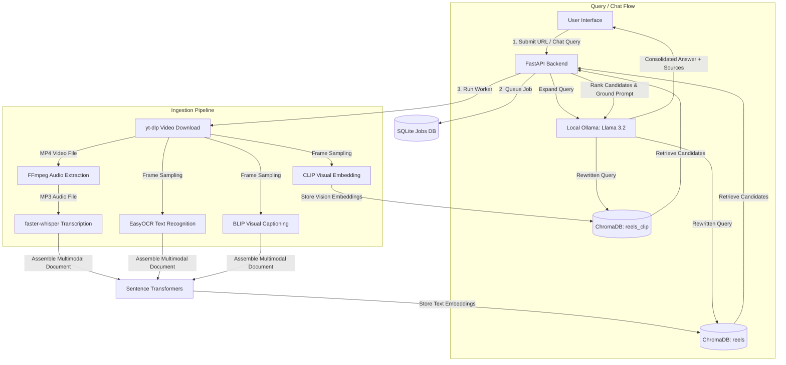

# ReelSearchAI 🎬🧠

A local-first, multimodal AI-powered Instagram Reel memory system. Download reels, transcribe audio, extract on-screen text via OCR, generate frame captions, index visual semantic embeddings, and chat with your personal reel repository—all running 100% on your machine.

---

## 📖 Overview

### The Problem
Instagram Reels are a rich repository of information, tutorials, and inspiration. However, once bookmarked, they are incredibly difficult to retrieve. Instagram's native search is limited to hashtags and generic captions, meaning you cannot search for spoken words, on-screen code snippets, visual scenes, or key themes. 

### Who It Is For
- **Content Creators & Researchers**: Curation of reference reels, coding tutorials, design inspiration, or marketing strategies.
- **Power Users**: Developers and AI enthusiasts who want to maintain an offline, local-first database of short-form video knowledge.
- **Privacy-Conscious Individuals**: Users who want private semantic indexing without sharing data with cloud APIs or incurring paid subscription costs.

### Why This Was Built
ReelSearchAI was designed to prove that production-grade multimodal AI ingestion pipelines can be hosted locally. By executing automatic frame-sampling, transcription, optical character recognition (OCR), visual image captioning, and LLM-based query rewriting/reranking on ordinary consumer hardware, it achieves privacy, offline availability, and zero running costs.

---

## 🚀 Key Features

- **Local Ingestion Queue**: Concurrent video downloading using `yt-dlp` and `FFmpeg` audio extraction.
- **Multimodal Video Processing**:
  - **Speech-to-Text**: High-fidelity transcription via `faster-whisper` (CPU-optimized `medium` model using `int8` quantization).
  - **Optical Character Recognition (OCR)**: Frame-based text extraction (English & Hindi) using `EasyOCR` to index on-screen text, code, or titles.
  - **BLIP Visual Captioning**: Automated frame analysis via `Salesforce/blip-image-captioning-base` to describe scene contents.
  - **CLIP Visual Semantics**: Cosine-similarity-based image embeddings using `openai/clip-vit-base-patch32` to enable searches for visual descriptions (e.g., "screencast of code editor", "person wearing blue hoodie").
- **Hybrid Semantic Search**: Merges text semantic distance (`sentence-transformers/all-MiniLM-L6-v2`) and visual CLIP scores using a weighted ranking algorithm (`TEXT_WEIGHT=0.65`, `CLIP_WEIGHT=0.35`).
- **Local LLM Enrichment & Reranking**: Integrates with a local `Ollama` instance running `Llama 3.2 (3B)` to perform:
  - **Query Expansion / Rewriting**: Resolving vague, indirect, or Hinglish queries.
  - **Result Reranking**: Evaluating the top retrieved candidates and filtering out irrelevant results.
  - **Relevance Feedback**: Generating structured inline descriptions of *why* a reel matched the query.
- **Conversational RAG Chat**: Chat with your entire reel collection. The local LLM answers questions by retrieving relevant reel context and grounding its response with interactive source citations.
- **Search Evaluation Dashboard**: A live analytics center displaying preset queries (English & Hinglish), per-result user relevance feedback, retrieval latency, success rates, and average match scores.
- **Library Management**: Browse all saved reels, verify file paths, re-index existing transcripts/captions with updated models, and safely delete items from both the local filesystem and ChromaDB collections.

---

## 🛠 Tech Stack

### Frontend
- **Framework**: Next.js 14 (App Router)
- **Language**: TypeScript
- **Styling**: Tailwind CSS + Custom Vanilla CSS variables for glassmorphism
- **Animations**: Framer Motion
- **3D Graphics**: Three.js & React Three Fiber (landing page interactive visual effects)
- **Data Fetching**: React Query (TanStack Query)

### Backend
- **Framework**: FastAPI (Python 3.10+)
- **Server**: Uvicorn
- **Concurrency**: SQLite WAL (Write-Ahead Logging) and `asyncio.Semaphore` job-queue scheduling

### Database / Vector Stores
- **Relational Storage**: SQLite (tracks pipeline state, background worker logs, and queue metrics)
- **Vector Database**: ChromaDB (local persistent vector store)
  - `reels` collection: Text semantic embeddings generated from transcripts, captions, and OCR.
  - `reels_clip` collection: Multi-frame visual semantic embeddings generated via CLIP.

### Local AI Models & Libraries
- **Transcription**: `faster-whisper` (quantized CPU-only Whisper)
- **Embeddings (Text)**: `sentence-transformers` (`all-MiniLM-L6-v2`)
- **Optical Character Recognition**: `EasyOCR`
- **Visual Image Captioning**: `Salesforce/blip-image-captioning-base`
- **Visual Embeddings**: `openai/clip-vit-base-patch32`
- **LLM Reasoning (Reranking & Chat)**: `Ollama` running `llama3.2:3b`

---

## 📐 Architecture

ReelSearchAI uses a decoupled producer-consumer architecture. Incoming download requests are written to SQLite as jobs and processed asynchronously in the background.



---

## 📂 Project Structure

```
REEL SAVER AI/
├── backend/
│   ├── main.py              # FastAPI app, API routers & worker pipeline logic
│   ├── db.py                # SQLite wrapper (Job management, WAL config, logs persistence)
│   ├── requirements.txt     # Python backend dependencies
│   ├── selftest.py          # Integration verification test suite
│   ├── verify_phase4.py     # Schema, WAL mode & SSE streaming test suite
│   ├── downloads/           # Media storage (gitignored)
│   │   ├── audio/           # Extracted MP3s
│   │   ├── transcripts/     # Generated Whisper TXT transcripts
│   │   ├── ocr/             # Extracted OCR text files
│   │   └── frames/          # Temporary frames used during processing
│   └── vector_db/           # ChromaDB database folders & SQLite files (gitignored)
├── frontend/
│   ├── app/
│   │   ├── (marketing)/     # Landing page route with premium 3D glassmorphism elements
│   │   ├── (platform)/      # Dashboard, Search, Library, Settings, and Processing interfaces
│   │   ├── globals.css      # Core style definitions
│   │   └── layout.tsx       # Root Next.js layout provider
│   ├── components/
│   │   ├── app/             # Topbar, GlassSidebar, CommandPalette, and Context Providers
│   │   ├── dashboard/       # Statistics modules and Activity monitors
│   │   └── ui/              # GlassCard, NavLink, SectionHeader buttons
│   ├── lib/
│   │   ├── api.ts           # Central API connection layer with TypeScript contracts
│   │   └── fetcher.ts       # Retrying HTTP requester
│   ├── tailwind.config.js   # Tailwinds design utility maps
│   └── tsconfig.json        # TypeScript compile parameters
└── README.md                # Documentation
```

---

## 💻 Setup & Run

### Prerequisites
- **Python**: 3.10 or higher
- **Node.js**: 18.x or higher
- **FFmpeg**: Must be installed and registered on your system's environment `PATH`
- **Ollama**: Installed and running locally (`ollama run llama3.2:3b`)

### Environment Variables

#### Backend (`backend/.env`)
Create a `.env` file in the `backend/` directory:
```env
MAX_CONCURRENT_PIPELINES=2
```

#### Frontend (`frontend/.env.local`)
Create a `.env.local` file in the `frontend/` directory:
```env
NEXT_PUBLIC_API_URL=http://127.0.0.1:8000
```

### Installation

#### 1. Clone the repository
```bash
git clone https://github.com/yourusername/reel-saver-ai.git
cd reel-saver-ai
```

#### 2. Start the Backend
```bash
cd backend
python -m venv venv

# Windows
.\venv\Scripts\activate

# macOS / Linux
source venv/bin/activate

pip install -r requirements.txt
python -m uvicorn main:app --reload --port 8000
```
*Note: The first ingestion job will automatically download the Whisper, EasyOCR, BLIP, and CLIP model weights (cached locally in `~/.cache`).*

#### 3. Start the Frontend
```bash
cd ../frontend
npm install
npm run dev
```
Open **[http://localhost:3000](http://localhost:3000)** in your browser.

---

## 📡 API Endpoints

### Jobs & Ingestion
| Method | Endpoint | Description |
|:---|:---|:---|
| `POST` | `/api/jobs` | Enqueue a new Instagram Reel URL for background download and processing. |
| `GET` | `/api/jobs` | List recent pipeline jobs with optional state filtering. |
| `GET` | `/api/jobs/{job_id}` | Retrieve current progress, stage, logs, and outputs of a job. |
| `GET` | `/api/jobs/{job_id}/stream` | Server-Sent Events (SSE) stream yielding real-time job progress changes. |

### Search & Analytics
| Method | Endpoint | Description |
|:---|:---|:---|
| `POST` | `/api/search` | Execute hybrid semantic search. Reranks results using local Llama model. |
| `POST` | `/api/feedback` | Register user relevance feedback (`relevant`/`not_relevant`) for a search match. |
| `GET` | `/api/search-analytics` | Fetch metrics like average search latency, success rate, and query counters. |

### Library & Control
| Method | Endpoint | Description |
|:---|:---|:---|
| `GET` | `/api/reels` | Fetch paginated indexed reels from database with keyword filter. |
| `DELETE` | `/api/reels/{reel_id}` | Cleanly remove a reel from SQLite, disk storage, and ChromaDB collections. |
| `POST` | `/api/reels/{reel_id}/reindex` | Refresh a reel's vector embeddings using stored transcript and captions. |

### AI Chat & System
| Method | Endpoint | Description |
|:---|:---|:---|
| `POST` | `/api/chat` | Interact with saved reels using conversational RAG. Returns source citations. |
| `GET` | `/api/system/health` | Get server status, CPU/GPU details, model memory states, and disk consumption. |

---

## 🖼 Screenshots

### Home Page

*(Premium visual entry screen showcasing interactive 3D particle systems and modern glassmorphism features)*

### Search Evaluation Dashboard

*(Integrated analytics interface showing preset search controls, latency, and success charts)*

### AI Chat Interface

*(Conversational agent interface showing answers grounded with citations to the specific stored reels)*

---

## 🧠 Lessons Learned

- **Quantized CPU-bound Inference**: Local model loading can overwhelm CPU memory on consumer hardware. Using `faster-whisper` with `int8` quantization reduced Whisper's RAM footprint from 1.5GB to under 450MB while maintaining high transcription accuracy and processing speed.
- **Asynchronous Execution & State Recovery**: Initial HTTP-based ingestion caused gateway timeouts when downloading long videos. Refactoring the pipeline into a background `asyncio` task pool managed by a SQLite job DB solved this. Using SQLite's **WAL (Write-Ahead Logging) mode** prevented database lock contention between the concurrent worker threads and the main server API thread.
- **Visual-Semantic Embedding Fusion**: Relying purely on speech transcription missed context when reels had text displays (e.g., code snippets) or visual demonstrations. Implementing a hybrid scoring mechanism (`0.65` weight for text semantic search on transcription/OCR, and `0.35` weight for CLIP image similarity on sampled frames) resulted in highly accurate retrieval of silent or sound-effect-heavy reels.
- **Robust Local LLM JSON Parsing**: Local model execution (via Ollama) often yields imperfect formats, such as wrapping JSON in markdown backticks or adding conversational text. I built robust parsing helpers in python that extract matching brackets, strip markdown wrappers, and fall back safely to base vector ranking if the model output is corrupted or timed out.

---

## 🚀 Future Improvements

1. **Temporal Video Search**: Highlight the exact timestamps in the video player where a keyword or visual match occurs.
2. **Video Segment CLIP Pooling**: Instead of static frame sampling, run real-time video encoding and pooling of segment vectors.
3. **Auto-Categorization & Clustering**: Apply K-Means clustering to ChromaDB embeddings to auto-generate reels playlists and thematic tags.
4. **Multi-User support / Local Auth**: Integrate Auth0/NextAuth and PostgreSQL for hosting on private servers with user isolation.
5. **Export & Integrations**: One-click export of transcripts and insights to Obsidian, Notion, and Markdown knowledge graphs.

---

## ✍️ Author

**Name**: [Your Name]  
**LinkedIn**: [Your LinkedIn Profile](https://linkedin.com/in/yourusername)  
**GitHub**: [Your GitHub Profile](https://github.com/yourusername)  
**Portfolio**: [Your Portfolio Link](https://yourportfolio.com)
